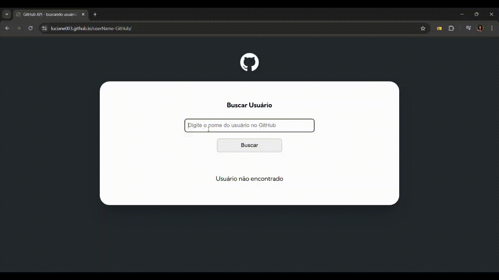

# ⭐ User Name GitHub 

## 📌 Descrição
Este projeto é um site onde você pode pesquisar por um usuário do GitHub.  
- Caso o usuário exista, são exibidas suas informações e repositórios.  
- Se não houver cadastro, o sistema avisa que não existe conta.  
- Se for digitado um usuário inválido, também aparece a mensagem de erro correspondente.  

##  🚧  Dificuldades
Este foi meu primeiro projeto consumindo uma API com **fetch**.  
No começo tive dificuldades por ser muita informação nova, mas com a ajuda e orientação do **meu curso** consegui entender e aplicar direitinho.  

## ✅ Funcionalidades
- Pesquisa de usuários do GitHub.  
- Exibição de informações do perfil.  
- Listagem de repositórios.  
- Tratamento de erros para usuários inexistentes. 

## 🌍 Projeto online

Acesse [aqui.](https://luciane003.github.io/userName-GitHub/)

## 🖼️ Demonstração

  

## 🚀 Tecnologias utilizadas

 
  
  
  

## 📂 Pré-requisitos
- Como clonar o repositório:

git clone (https://github.com/luciane003/userName-GitHub.git)

## 👩‍💻 Autora
- Luciane Kellen
- Feito como parte do meu processo de aprendizagem em programação!

  
  
  

## Agradecimentos
Projeto desenvolvido com apoio das aulas do meu curso de programação, que foram essenciais para compreender melhor o consumo de APIs.
